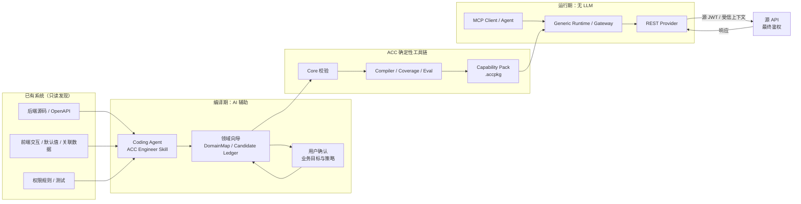
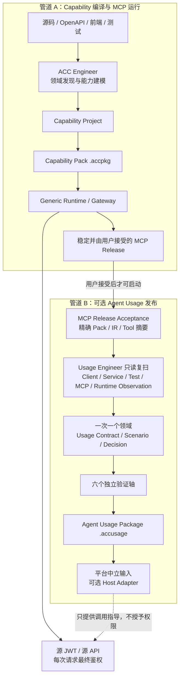
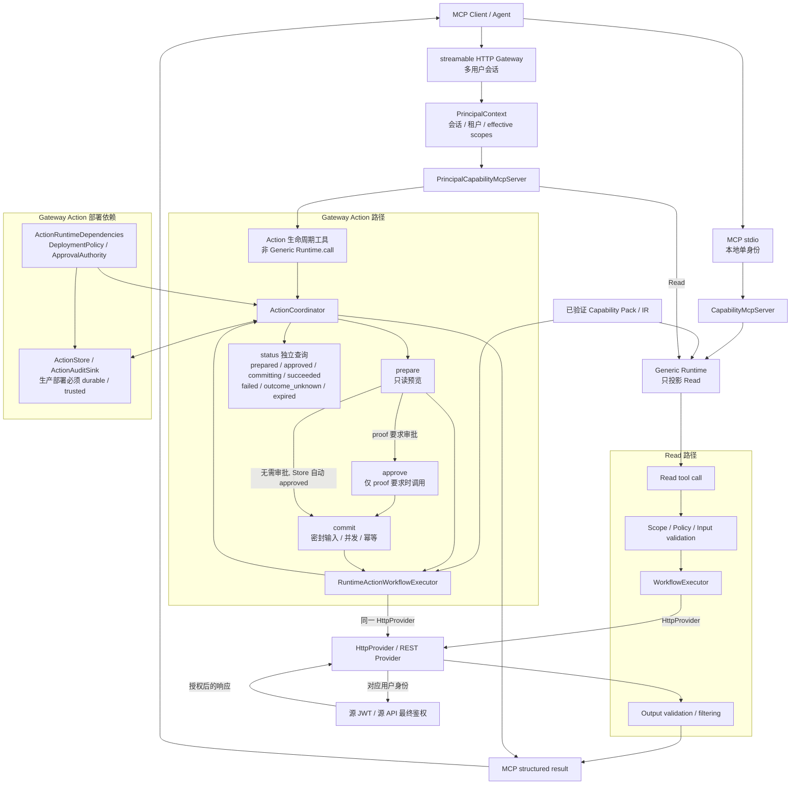

# Agent Capability Compiler (ACC)

ACC 是一个**零代码侵入式 Agent 能力接入工具链**。它帮助 Coding Agent 从已有系统的源码、接口文档、前端交互、默认值、关联数据、权限规则和测试中提取有证据支持的业务能力，将其编译为可重复构建的 Capability Pack，再由固定的通用 Runtime 通过 MCP 暴露给 Agent。

ACC 不修改已有业务系统，不要求业务系统嵌入 Agent SDK 或接入 MCP。运行时只访问已有 REST API，或访问独立部署的旁路 Adapter。

> [!IMPORTANT]
> 已完成的本地端到端验收只证明对应的本地合同，不代表生产发布、生产安全认证，也不代表任何未连接业务系统的源码或在线数据已经验证。请结合[开发状态](#开发状态)、示例交接报告和后续发布说明判断使用范围。

## 为什么需要 ACC

直接让模型观察系统并临时拼接请求，难以保证权限、证据和行为可重复。ACC 将接入过程拆成两个边界清晰的阶段：

- **编译期有 AI**：Codex、Claude Code 等宿主负责分析、规划、创建能力定义、运行测试并根据诊断修复。
- **运行期无 AI**：ACC Runtime 只执行已经校验和编译的 Pack。Runtime 不调用 LLM，不生成代码，不临时构造未知请求。

完整链路如下：



Capability Pack 是 AI 辅助编译期与无 LLM 运行期之间仅包含数据的边界。用户确认表达业务目标和策略，但不能替代 Evidence、确定性校验或源 API 对每次请求的最终授权。

## AI 领域向导式能力发现

全局 AI 扫描由 ACC Engineer Skill 所在的 Coding Agent 执行；ACC Core 与 Runtime 都不调用 LLM。Agent 先对后端、OpenAPI、客户端交互、默认值、选项、条件和关联数据做全局浅扫，生成平台中立的 `DomainMap` 与 `CapabilityCandidateLedger`。这一步是编译期分析工作，不表示 ACC Runtime 内置了扫描模型，也不表示任何生产系统已被扫描或验证。

已有系统未声明范围时默认采用 `system_complete`。这里的“完整”是完整业务表面，不是 Read-only 子集：Read、Create、Update、Delete、transition、execute 以及跨接口 composite intent 都必须进入发现与决策分母。缺少写沙箱授权，或缺少 effect/risk/retry/idempotency/concurrency/approval/outcome Evidence 时，对应 Action 只能保留为 `undetermined`、`blocked_on_evidence`，并阻止领域与系统 complete；不能把它标为 excluded/ineligible 或从分母删除后宣称闭合。若用户只需要只读交付，应明确确认 `pilot`，而不是改写 `system_complete` 的含义。

向导随后按依赖和显式优先顺序，一次只激活一个已就绪的业务领域：

1. 用户确认业务目标与策略，不逐条选择 route，也不逐条审核全部接口。
2. Coding Agent 深扫当前领域，把证据清晰的 Read、Action 和纯客户端候选自动分类；涉及默认数据、关联数据或展示条件时同时保留前端证据。
3. 无法由 Evidence 闭合的例外一次只问一个问题。`unknown` 候选不能被伪装为 `ineligible` 或消失；只有独立 Evidence 支持的客观不可用结论才允许判为 ineligible。Eligible Action intent 不能靠 exclusion 闭合；重复 route 只有在 replacement materialize 相同 mutation intent 和完整 Action lifecycle 时才可 composed。
4. 当前领域形成版本化的 `DomainDecision`，绑定候选、依赖和 Evidence 快照；完成并确认后才进入下一个领域。

用户选择的是业务目标、允许的效果、风险上限、需审批的业务意图和明确排除项。route、接口字段、Candidate 分类与安全声明由 Evidence 和确定性校验闭合，不能通过用户随手勾选获得真实性。

源 JWT 与源 API 是最终授权者。ACC Scope 只能收窄源系统可能允许的范围，不能创建角色、授予权限或替代源系统逐请求鉴权；Action approval 只批准一次已证明的业务变更，也不是源权限。

## 可选的 Agent Usage 管道

Capability 能正确通过 MCP 暴露，不等于 Agent 已经知道一个业务目标需要按什么顺序调用工具、前端默认值和条件如何影响输入、哪个结果字段要继续传给下一步，以及失败或陈旧数据应如何处理。因此 ACC 在 Capability 管道之后提供一条**独立、可选但推荐**的 Agent Usage 管道。

它不会在第一次生成 MCP 时自动运行。用户应先自行测试 Capability Pack，经过多轮反馈并明确接受一个固定 MCP Release；只有这条基线稳定后，Usage Engineer 才重新只读扫描所选领域的 Client、Service、Test、MCP 和 Runtime Observation 证据，恢复真实使用路径。Client 证据包括 Web、移动端、桌面端、CLI 与自动化调用，因此会二次确认只有前端或其他客户端才能证明的默认值、关联数据、条件展示和结果消费。向导仍然一次处理并确认一个完整业务领域，而不是让用户逐条审核全部接口或全部 route。



Usage Release 保留六个相互独立的事实：`source_usage_traced`、`usage_contract_verified`、`headless_agent_verified`、`host_adapter_verified`、`real_mcp_verified` 和 `user_accepted`，不计算总分，也不从一个轴推导另一个轴。缺少真实 MCP 轨迹、宿主适配验证或其他证据时必须保留为 `limited`；只有发布所需的核心轴全部成立时才是 `released`。手写 Evidence、文件名或自我声明的连接标签都不能把 `real_mcp_verified` 设为 true；该轴只能来自专用 real MCP runner 的受信结果，而且不能据此冒充生产源连接。

`.accusage` 只包含已发布领域中用户选定的业务目标和 route 闭包、精确 Decision/Release、Scenario 与必要 Evidence 身份元数据；不嵌入源文件、`.accpkg`、JWT、请求 payload 或未发布领域。核心输出是平台中立合同，Generic Markdown、MCP Resources/Prompts 或其他宿主格式都是可选 Adapter，不能增加工具、权限或 Action 快捷路径。

CLI 发布和构建只接受独立受信 runner 生成的签名 verification artifact，不把 Usage 工程中的序列化 verification 声明升级为证据。artifact 绑定当前 Project、accepted MCP、Pack/IR/Tool Schema/测试报告、Domain、Decision、Scenario 与 release bundle，含 nonce 和最长 24 小时的有效期；篡改、过期、stale 或摘要不匹配均 fail-closed。HMAC trust-store 必须位于 source workspace、ACC project 和 Usage project 三根目录之外且不得经过 symlink/junction，artifact 自身只携带 `key_id`；包签名 Secret 通过环境 SecretRef 名称提供，不能作为 CLI 明文参数。

## 产品边界

ACC 负责：

- 稳定的 `acc` CLI、Schema 和结构化诊断；
- Evidence 绑定、引用检查、Policy 校验和 Workflow 编译；
- SourceContract、CapabilityQuality、Eval、九个基础质量轴、十个交互轴与十二个相互独立的领域与 Action Coverage 轴，以及可重复构建的 Capability Pack；
- 固定通用 Runtime、MCP stdio、REST Provider、Provider 级认证和 SecretRef；
- Adapter SDK 基础契约、测试工具和 Fake Adapter；
- 面向 Coding Agent 的 ACC Engineer 与独立 ACC Usage Engineer Skills。

ACC **不**负责：

- 集成 OpenAI、Anthropic 或其他模型 SDK；
- 模型选择、Token 管理、上下文压缩、Agent Loop、模型重试或计费；
- 修改原系统代码、数据库结构、认证逻辑或部署；
- 在 Runtime 中动态生成代码、HTTP 请求或工作流；
- 生产级 Action 审批 UI、durable Action Store、集中审计控制面，以及插件市场、Kubernetes、Helm、OCI、SOAP、gRPC、数据库 Adapter、消息队列、RPA 或浏览器录制。

当前唯一格式为 `2`。稳定可执行入口支持证据绑定的 Read Operation、Capability Pack、MCP stdio 和多用户 `streamable_http` Gateway。经编译证明且被部署策略允许的 Action 会在 Gateway 中暴露为业务专属 `<capability_id>.prepare` 工具：`prepare` 生成受信预览，只有 proof 要求时才调用 `approve`，随后才能 `commit`；`status` 可独立查询生命周期状态。普通 `tools()`/`call()` 仍不能绕过该生命周期直接执行写操作。生产部署必须显式提供 durable Action Store、可信 ApprovalAuthority、审计 Sink 与 effect/risk/capability ceiling；ACC 不内置生产审批 UI 或持久化实现。Gateway 是 Generic Runtime 的可选运行时适配层：它负责 HTTP 身份、会话隔离和请求级 `PrincipalContext`，不是用户/租户管理平台、权限源或 SaaS 控制面。

## 架构

### 编译期：从系统事实到 Capability Pack

```mermaid
flowchart LR
  subgraph discovery["只读发现"]
    SOURCES["Backend / OpenAPI / Frontend / Tests"]
    SCAN["Coding Agent + ACC Engineer Skill"]
    FACTS["Evidence / Scope Inventory"]
  end

  subgraph domains["领域向导"]
    LEDGER["DomainMap / Candidate Ledger"]
    SELECT["依赖就绪排序<br/>一次处理一个领域"]
    GOALS["用户确认业务目标 / DomainPolicy"]
    DECISION["版本化 DomainDecision"]
  end

  subgraph contracts["当前格式项目"]
    SOURCE_CONTRACT["SourceContract / InteractionContract"]
    DEFINITION["Operation / Capability / Policy / Eval"]
  end

  subgraph gates["确定性门禁"]
    VALIDATE["validate_project<br/>Schema / Closure / Action Safety"]
    IR["Capability IR"]
    PACK_BUILD["确定性 Capability Pack"]
  end

  ANALYZE["独立发布 / 验收门禁<br/>Coverage / Contract Tests"]
  BLOCKED["Evidence 缺口 / 冲突<br/>保持 blocked 或 unknown"]

  SOURCES --> SCAN --> FACTS --> LEDGER
  LEDGER --> SELECT --> GOALS --> DECISION
  DECISION --> SOURCE_CONTRACT --> DEFINITION --> VALIDATE
  VALIDATE -->|"通过"| IR --> PACK_BUILD
  VALIDATE -.->|"独立报告"| ANALYZE
  PACK_BUILD -.->|"发布 / 验收输入"| ANALYZE
  VALIDATE -->|"诊断"| BLOCKED --> SCAN
```



AI 负责从系统事实中提出候选、补充定义并处理诊断。`compile_project` 以 `validate_project` 为硬门禁：Schema、引用闭合与 Action Safety 通过后才能产出 Capability IR，并进一步构建可验证的 Pack。Coverage 和 Contract Tests 是独立的发布与验收门禁，不参与 `compile_project` 的控制流。Evidence 不足的候选继续保留为 `blocked` 或 `unknown`，不会靠用户确认自动变成可执行能力。

### 运行期：Read 与 Action 共用源权限终裁



stdio 通过 `CapabilityMcpServer` 调用固定身份的 `GenericRuntime`；Gateway 通过 `PrincipalCapabilityMcpServer` 为每个请求解析 `PrincipalContext`。已验证 Pack/IR 构造只投影 Read 的 `GenericRuntime`；若 IR 含 Action，Gateway 还必须从同一份已验证 IR、同一个 `HttpProvider` 和部署方显式提供的 `ActionRuntimeDependencies` 构造 `ActionCoordinator`。Pack 不直接构造任何 MCP Server。

传输方式不改变权限终裁：Read 与 Action 的源操作最终都由同一个 `HttpProvider` 携带对应身份访问源系统，并接受源 JWT 和源 API 的逐请求鉴权。`approve` 仅在编译证明要求审批时调用；无需审批的 `prepare` 会在 Store 内自动进入 `approved`，之后才能 `commit`。`status` 是 Coordinator 对受信 Store 的独立生命周期查询，不是固定的最后一步；采用 `status_query` 结果解析策略时，对源状态的访问发生在 `commit` 内。生产 `ActionRuntimeDependencies` 必须包括 `DeploymentPolicy`、durable `ActionStore`、可信 `ApprovalAuthority` 和 `ActionAuditSink`；仓库内的内存实现仅用于开发与测试，不能替代它们。

仓库的文档测试只对 Mermaid 源码执行标签、节点、关键边和禁止边的结构烟测；仓库没有内置 Mermaid parser，因此这些测试不等同于渲染器语法证明。

### 组件职责

仓库由四个可独立测试的 Python 包和两套平台中立、顺序衔接但互不耦合的 Engineer Skill 组成：

| 组件 | 职责 |
| --- | --- |
| `acc-core` | 数据模型、JSON Schema、CLI、Evidence、校验器、编译器、Coverage、Eval、Pack |
| `acc-runtime` | Pack Loader、MCP stdio、streamable HTTP Gateway、`PrincipalContext`、Read Workflow、REST Provider、Policy，以及由部署依赖组合的 Action 生命周期 |
| `acc-adapter-sdk` | Adapter Contract、Server 基础骨架、测试工具和 Fake Adapter 示例 |
| `acc-testkit` | Fake REST System、MCP 测试客户端、E2E 断言、交互契约评估、故障模拟和示例数据；Fake/offline 结果不是源连接证明 |
| `skills/acc-engineer` | `preflight → analyze → model → plan → implement → validate → test → refine → handoff` |
| `skills/acc-usage-engineer` | 在用户接受稳定 MCP Release 后，按领域执行 `preflight → scan → model → review → build → test → impact → release → handoff`；不参与 Capability 编译 |

### 读图时必须保持的边界

1. Core 与 Runtime 不调用 LLM；AI 只在 Coding Agent 的编译期。
2. Pack 不保存用户账号、密码、JWT 或可直接使用的 Authorization Header。
3. 用户确认只表达业务目标与策略，不能替代 Evidence 或授予源权限。
4. Read tool 不能绕过 Action 生命周期执行 mutation；Action 必须先 `prepare`，进入 `approved`（自动或按 proof 审批）后才能 `commit`，`status` 可独立查询。
5. Fake/offline 验证不能升级为生产 `source_connected_verified`。

其他核心原则：

1. **Skill-first**：AI 能力由 Coding Agent 宿主提供，ACC 本身不集成模型。
2. **AI 负责创造，ACC 负责约束**：分析和候选定义可以由 Agent 完成，最终有效性由确定性工具验证。
3. **通用 Runtime**：每个系统只生成数据化的 Pack，不复制一套 Runtime 源码。
4. **证据先于约束**：Evidence 通过 SourceContract provenance 支持 Operation Schema；观测样本不能证明业务上界。
5. **默认拒绝写**：Action 只有同时通过 effect/risk、部署 allowlist、Scope、按 proof 要求的审批或自动 `approved` 状态、幂等和并发门禁才可能执行。
6. **原系统源码只读**：所有生成物写入独立 ACC 项目；Engineer Skill 最终停在人工 Git Review 之前。

详细设计决策见 `docs/architecture/adr/`。

## 快速开始

### 环境要求

- Python 3.12
- [`uv`](https://docs.astral.sh/uv/)
- Git

### 从源码准备开发环境

```bash
git clone <your-fork-or-repository-url> agent-capability-compiler
cd agent-capability-compiler
uv sync --all-packages --group dev
uv run acc --help
```

当前格式的接入流程如下：

```bash
# 在独立目录创建 ACC 项目；不要在原系统目录中生成文件
mkdir my-system-acc
cd my-system-acc
acc init

# 检查环境和只读边界
acc doctor --json

# 校验、编译和查看覆盖率
acc validate --json
acc compile --check --json
acc coverage --json

# 执行契约、Runtime 和端到端测试
acc test contract --json
acc test runtime --json
acc test e2e --json

# 生成 Pack，并由通用 Runtime 以 MCP stdio 方式运行
acc pack --json
acc run example-crm-0.1.0.accpkg
```

以上命令均已在当前检出版本实现；开发仓库中可以统一写成 `uv run acc ...`。Coverage 只报告相互独立的事实轴，并要求项目根存在合法 `scope-inventory.yaml`。

真实 Gateway 联调只有通过 `acc test live` 的完整 source-connected 门禁后，才能生成 Coverage 可消费的机器证据：Profile 中每个计入 Coverage 的成功用例必须显式声明 `capability_id`，命令通过 `--observations-output` 写出规范 JSON；Coverage 再通过 `--live-observations` 显式加载。产物绑定已校验 Pack、Pack 内 compiled IR、Project id/version、Profile 与原始 Live Report，并有 24 小时有效期。内容摘要不符、过期、Project/IR 不匹配、非规范 JSON 或符号链接都会被拒绝；普通 `test-report.json`、`coverage-report.json` 和手写摘要不会被接受。未提供产物时仍报告 `not_observed`。

```bash
acc test live build/my-system.accpkg \
  --gateway-url http://127.0.0.1:8000 \
  --profile live-tests.yaml \
  --allow-source-connect \
  --observations-output build/live-observations.json \
  --json

acc coverage . \
  --live-observations build/live-observations.json \
  --live-pack build/my-system.accpkg \
  --json
```

### 运行多用户 Gateway

仅当 Pack 声明 `runtime.transport: [streamable_http]`，且 Provider 使用 `password_bearer + gateway_session` 时，`acc run` 才会启动 Gateway。最小的本机明文示例是：

```bash
uv run acc run build/my-system.accpkg \
  --host 127.0.0.1 \
  --port 8000 \
  --allowed-host 127.0.0.1:8000 \
  --allowed-origin http://127.0.0.1:3000 \
  --scope customer.read \
  --session-ttl 3600 \
  --max-sessions 1000 \
  --mcp-idle-timeout 60 \
  --body-limit 4194304 \
  --workers 1
```

`--allowed-host` 至少给出一个精确值；`--allowed-origin` 也是精确清单，不支持通配符。端口、TTL、容量、MCP idle timeout 和请求体上限均由部署方显式限定。Gateway 只支持单进程 `--workers 1`，因为 Gateway Session 与 MCP Session 均是进程内状态。明文 HTTP 只允许绑定 loopback；绑定非 loopback IP 必须同时提供 `--tls-certfile` 和 `--tls-keyfile`，或在受信反向代理后仅监听 loopback。

Gateway 的 `acc run` 不加 `--json` 时启动并持续服务；加 `--json` 时只加载 Pack、验证 Gateway 组合并返回脱敏配置，不启动监听器。

需要由 CLI 运行可恢复的单节点生产 Action Gateway 时，必须一次性显式提供四组互相独立的
SQLite 边界：Action Store、加密 Session Vault、Approval Authority 和 required Action Audit：

```bash
uv run acc run build/my-action-system.accpkg \
  --host 127.0.0.1 --allowed-host 127.0.0.1:8000 --scope orders.write \
  --production-actions \
  --action-store-path ./var/actions.db \
  --action-store-secret-ref ACC_STORE_SECRET --action-store-salt-ref ACC_STORE_SALT \
  --session-vault-path ./var/sessions.db \
  --session-vault-key-ref ACC_VAULT_KEY --session-vault-salt-ref ACC_VAULT_SALT \
  --approval-db-path ./var/approvals.db \
  --approval-secret-ref ACC_APPROVAL_SECRET --approval-salt-ref ACC_APPROVAL_SALT \
  --audit-db-path ./var/action-audit.db \
  --audit-secret-ref ACC_AUDIT_SECRET --audit-salt-ref ACC_AUDIT_SALT \
  --action-capability orders.update --action-effect update --action-max-risk medium
```

所有 SecretRef 都只允许引用环境变量；八个引用名、解析后的值及四个数据库路径必须分别唯一，
缺一项即拒绝启动。生产模式固定要求 durable Store、durable Approval Authority、required durable
Audit、加密 Vault 和关闭的 sandbox，不允许与 `--development-actions`、本地 guard 或本地 operator
混用。Gateway lifespan 对全部资源执行幂等关闭，保留持久状态。`--json` inspection 只报告
`production_single_node`、`sqlite` 和 `durable` 等非敏感属性，不显示路径、引用名或 secret。
这是单节点参考部署，不是多节点 HA 或外部审批控制面。

含 Action 的 Pack 默认拒绝由 CLI 启动，因为生产部署必须由宿主通过 Runtime API 注入 durable Action Store、可信 ApprovalAuthority、required AuditSink 与 operator-owned DeploymentPolicy。仅开发和测试时，可以显式启用进程内依赖，并同时给出 capability、effect、risk 三层 ceiling：

```bash
uv run acc run build/my-action-system.accpkg \
  --host 127.0.0.1 \
  --allowed-host 127.0.0.1:8000 \
  --scope orders.write \
  --development-actions \
  --action-capability orders.update \
  --action-effect update \
  --action-max-risk medium
```

`--development-actions` 不会从 Pack 推导或扩大授权；缺少任一 ceiling 都会拒绝启动。它默认使用 non-durable in-memory Store，并固定使用仅测试用 in-memory ApprovalAuthority 和 required logging audit，不得用于生产。此 CLI 模式支持 `approval: not_required` 的 `prepare -> commit -> status`；`approval: required` 仍要求 trusted host 通过独立审批边界签发 approval handle，或另行显式启用下述本地操作者入口。

默认 Store 仍为 `memory`。需要在开发 Gateway 重启后保留经过认证的 Action 行时，可显式选择
SQLite，并分别配置独立 SecretRef：

```bash
export ACC_ACTION_STORE_SECRET='<at-least-32-byte-secret>'
export ACC_ACTION_STORE_SALT='<at-least-16-byte-independent-salt>'
uv run acc run build/my-action-system.accpkg \
  --host 127.0.0.1 \
  --allowed-host 127.0.0.1:8000 \
  --scope orders.write \
  --development-actions \
  --development-action-store sqlite \
  --action-store-path ./var/actions.db \
  --action-store-secret-ref ACC_ACTION_STORE_SECRET \
  --action-store-salt-ref ACC_ACTION_STORE_SALT \
  --action-capability orders.update \
  --action-effect update \
  --action-max-risk low
```

SQLite 的 path、secret ref、salt ref 必须同时给出；两个引用名和值都必须不同，也不得复用本地
operator approval 的引用名或 secret 值。数据库路径继续由 `SQLiteActionStore` 的非链接、常规文件、
父链和权限检查 fail closed；inspection 只显示 `store: sqlite` 与 `store_durable: true`，不显示路径、
SecretRef 或 secret。Gateway lifespan 关闭 Store 但保留认证数据库行。

持久化 Store 不等于持久化 Gateway 会话或本地 operator registry。SQLite 可以恢复已 approved、
committing、succeeded 等绑定状态，但 Gateway 重启后 session ID 会改变：旧 handle 的 `status`、
commit 或其他绑定操作仍会因原 principal/session 绑定不匹配而拒绝。尤其是重启前仍为 prepared 的
handle，无法通过重启后新建的本地 operator endpoint 审批，因为其仅存于进程内的摘要 registry 已
清空；必须由原用户在新会话重新 prepare。不得据此承诺 RuoYi 等系统重启后可继续查询或审批旧 handle。

若 Action Operation 如实声明源端 `concurrency.mode: not_supported`，且 Capability 使用
`action.local_development_state_guard`，还必须在上述开发开关之外再次显式加入
`--local-development-action-guards`。该选项注入有界、进程内的资源锁，并在 commit 前用
密封的 prepare input 重跑声明的 Read：状态漂移即拒绝、terminal 状态幂等返回、上游读取失败
即 fail closed。它只防止同一 ACC 进程内的协作者竞争，不能阻止外部客户端写入，也不提供或
暗示源系统原子并发保证；因此生产策略默认禁止，`--workers 1` 和隔离本地/测试源仍是硬边界。
`acc run --json` 的 inspection 仅显示 `process_local_only` 或 `disabled`，不会输出锁键、资源值或
锁表内容。

开发环境中，`approval: required` 可选用与 MCP 用户面完全分离的本地操作者入口。先在环境中
配置至少 32 字节的独立 secret，再显式启用：

```bash
export ACC_ACTION_OPERATOR_SECRET='<high-entropy-local-secret>'
uv run acc run build/my-action-system.accpkg \
  --host 127.0.0.1 \
  --allowed-host 127.0.0.1:8000 \
  --scope orders.write \
  --development-actions \
  --development-action-operator-approval \
  --action-operator-secret-ref ACC_ACTION_OPERATOR_SECRET \
  --action-capability orders.update \
  --action-effect update \
  --action-max-risk low
```

操作者向 `POST /operator/actions/approve` 提交严格 JSON `{"action_handle":"..."}`，并用
`X-ACC-Operator-Authorization: Bearer <secret>` 认证。入口只在 loopback、单进程、development
Action 依赖同时启用时存在；请求体上限 1 KiB。它重新绑定 prepare 时保存的受信会话身份、
短期签发 approval 并内部完成 approve，响应只含 capability ID 与 `approved` 状态，不返回
action handle、approval handle 或 binding。它不会出现在 MCP `tools/list`，也不会 commit。
当前首版仅随 `streamable_http` Gateway 提供；`stdio` Pack 明确不支持此 HTTP operator 入口，
且传入相关 CLI 参数会拒绝启动。缺 secret、非 loopback、默认/生产模式均 fail closed。

客户端先向 `POST /runtime/sessions` 一次性提交当前用户的账号和密码，然后用响应中的 opaque Gateway token 作为 `Authorization: Bearer ...` 调用 `/mcp`。密码在登录边界使用后即丢弃；源 JWT 只存在当前进程的认证状态中；客户端持有的是另一枚短期、不透明 Gateway token，服务端会话索引只保存其摘要。用户 A/B/C 各自登录，得到独立 Gateway Session 和独立 MCP Session；Agent 无需再把用户标识放入工具参数。

```json
{
  "identity": "user@example.test",
  "password": "<one-shot secret>"
}
```

`DELETE /runtime/sessions/current` 会使当前 Gateway token 立即无效。MCP SDK 1.29 没有按单个 Gateway Session 立即 terminate 底层 Streamable HTTP 传输的公开管理 API，因此已建立的 SSE/传输实例会在有限 `--mcp-idle-timeout` 内回收；它在此期间也无法通过失效 token 成功执行新请求。源系统返回 401 时，只把对应 Gateway Session 标记为需重新认证，其他用户会话不受影响。

## CLI 契约

当前 CLI 命令面如下：

```text
acc init
acc doctor
acc schema
acc validate
acc compile
acc coverage
acc diff
acc freeze
acc test
acc pack
acc run
acc adapter init
```

所有命令都必须支持 `--json`。成功输出：

```json
{
  "ok": true,
  "command": "validate",
  "result": {},
  "diagnostics": []
}
```

失败输出仍保持同一结构，并提供可供 Coding Agent 定位和修复的稳定诊断：

```json
{
  "ok": false,
  "command": "validate",
  "result": null,
  "diagnostics": [
    {
      "code": "ACC_OPERATION_EVIDENCE_MISSING",
      "severity": "error",
      "message": "Operation requires at least one evidence reference.",
      "path": "operations/crm.get_customer.yaml",
      "pointer": "/evidence"
    }
  ]
}
```

稳定退出码：

| 退出码 | 含义 |
| ---: | --- |
| `0` | 成功 |
| `2` | CLI 用法错误 |
| `3` | Schema 或输入错误 |
| `4` | 编译错误 |
| `5` | 测试错误 |
| `6` | Pack 或 Runtime 错误 |

MCP 模式下，协议消息只写 stdout；日志只写 stderr。

## ACC 项目格式

`acc init` 创建的项目由声明式文件组成。一个最小项目预期如下：

```text
my-system-acc/
├── project.yaml
├── operations/
│   └── crm.get_customer.yaml
├── capabilities/
│   └── get_customer_context.yaml
├── policies/
│   └── crm-sales-read.yaml
├── evals/
│   ├── get-customer-context-normal.yaml
│   └── get-customer-context-cross-tenant-denied.yaml
├── evidence/
└── fixtures/
```

### Project

Project 绑定只读源码工作区和 HTTP Provider，但只保存凭据引用。当前合同如下：

```yaml
schema_version: "2"
project:
  id: example-crm
  version: 0.1.0
source_workspace:
  path: ../system
  mode: read_only
runtime:
  transport: [stdio]
provider:
  kind: http
  base_url_ref: CRM_BASE_URL
  application_success:
    kind: json_pointer
    pointer: /code
    allowed_values: [200]
  auth:
    kind: bearer_secret
    token_ref: CRM_USER_TOKEN
quality:
  profile: standard
```

认证是 Provider 合同，不是 Operation 参数。新项目按目标系统选择以下互斥配置：

- `none`：源系统不要求认证，不携带 credential source。
- `bearer_secret`：从 `token_ref` 指向的部署环境变量读取既有 Bearer Secret；适合本地 `stdio` 的服务账号或测试账号。
- `password_bearer`：调用配置的登录端点换取 JWT。`stdio` 只能使用环境中的账号/密码引用；`streamable_http` 只能使用 Gateway 会话提交的一次性登录材料，Pack 不保存用户账密或 JWT。

若登录端点除账号密码外还要求公开的协议字段，可声明
`auth.login_request.static_fields`，例如 `clientId` 或 `grantType`。这些字段仅接受有限数量的
JSON scalar，并随 Pack 公开；不能覆盖 `identity_field`/`password_field`，也不能使用
password、token、secret、authorization、key 等敏感字段名。客户端密钥不能放在这里，未来
如需支持必须使用单独的 SecretRef 合同。序列化后的登录请求固定限制为 64 KiB。

`scopes_pointer` 默认要求源响应为 JSON string array。若上游遵循 OAuth 的空格分隔 scope
字符串，可显式声明 `scopes_format: space_delimited`；解析只接受 ASCII whitespace，限制为
8 KiB/1024 项并去重，Unicode whitespace、控制字符和错误类型都会令登录失败。空字符串
表示已验证的空权限集；最终权限仍同时受 `scope_mapping` 与 Gateway deployment ceiling 限制。

若登录响应本身不含权限，可声明可选 `scope_discovery`：Runtime 用刚换取的 Bearer token
执行一次同源、禁止重定向的 GET，再从有界 JSON 响应读取 scopes。首版只支持公开 scalar
`static_query_fields`，不支持静态 header；authorization/cookie/token/key/secret 等名称仍被拒绝。
Discovery 可独立限定 timeout、响应字节数及业务成功码，任何 HTTP、业务 envelope、类型、大小
或超时错误都会让整个登录失败，token 不会进入缓存。

Operation 不得保存 `credential_ref`；认证只能通过 `provider.auth` 表达。Project 必须选择质量 profile，并为每个 Operation 配套 SourceContract、为每个 Capability 配套 CapabilityQuality。旧格式文档和 Pack 会被稳定拒绝，不做隐式迁移。

`provider.application_success` 是可选的 JSON envelope 业务成功合同。像 mall 这类无论成功或失败都返回 HTTP 200 的系统，应声明业务码 JSON Pointer 与精确成功值；Runtime 会在输出 Schema 校验前拒绝业务 401/403/500 或缺失业务码，避免把“接口可达”误报成“业务成功”。普通非 envelope API 不声明该字段，ACC 不会猜测名为 `code` 的领域字段含义。

### Operation、Evidence 与 SourceContract

Operation 是已有系统的原子 HTTP 操作。Read 必须显式声明 `effect: read`；`POST` 等非安全方法若用于查询，还必须提供证据分类，不能只凭 HTTP 方法猜测效果。正式 Operation 必须绑定 Evidence：

```yaml
schema_version: "2"
id: crm.get_customer
title: 获取客户资料
kind: read
input_schema:
  type: object
  additionalProperties: false
  required: [customer_id]
  properties:
    customer_id: {type: string}
output_schema:
  type: object
  additionalProperties: false
  required: [id, name]
  properties:
    id: {type: string}
    name: {type: string}
http:
  method: GET
  path: /customers/{customer_id}
  path_parameters:
    customer_id: customer_id
  scopes: [customer.read]
  timeout_seconds: 15
  max_response_bytes: 1048576
safety:
  effect: read
evidence:
  - source_id: crm-backend
    locator: app/api/customers.py#L42-L68
    digest: sha256:<content-digest>
```

Evidence 可以定位到文件和行号、JSON Pointer 或 OpenAPI Operation，并携带内容摘要。ACC 不允许用常识或模型猜测补全路径、字段、Scope 或租户规则。

SourceContract 将证据归一化为 `request_schema`、`response_schema`、完整性和 JSON Pointer 级 provenance。Action Operation 还必须提供证据绑定的 `action_semantics`，逐字段证明 method、effect、risk、reversibility、retry、idempotency 与 concurrency；仅运行观测不能作为安全降级依据。Operation 输入必须是源系统可接受请求的安全子集；Operation 输出必须覆盖源系统可能返回的响应。无法证明的 Schema 关系报告 `unknown`，证据冲突报告错误；运行观测不能用来伪造 `maxItems`、`maxLength` 等上界。

UI Interaction 的 `complete` 也不是 API wrapper 清单。每个 surface 必须用嵌入式 immutable Evidence 证明平台中立的 entry 与 usage context；同一 endpoint 在多个 page/dialog/flow 中的业务语境不得折叠为一个 interaction。每个 interaction 对 input bindings、defaults、option sources、conditions、related data、result consumption、states 七个维度逐项声明 `applicable` 或 evidence-backed `not_applicable`。完整分母中的 interaction 必须被 Capability adopt，或以明确 authority 与 Evidence omitted；裸空数组、虚构 router/surface 或 route-only Evidence 不能闭合 `system_complete`。

如果源接口需要可信身份或租户值，Operation 用 `context_bindings` 声明注入位置，例如把 `tenant_id` 绑定到 `tenant_context.tenant_id`。绑定值只能由 Runtime 的不可变 `PrincipalContext` 提供，Agent 输入和 Workflow 参数都不能覆盖；Provider 还必须通过 `context_binding_allowlist` 显式允许租户路径。`PrincipalContext` 保存 principal、目标系统、有效 Scope 和受限租户上下文，但不公开 JWT、密码、Authorization Header 或内部认证状态。

### Capability、Policy 与 Eval

Capability 是 Agent 看见的业务级工具，可以组合多个 Operation。Read Workflow 支持：

```text
call  pick  map  filter  assert  redact
branch  parallel  foreach  emit
```

Workflow 不是任意代码执行环境：不支持 Python、JavaScript、shell、`eval`、动态导入或动态 URL。所有引用必须在编译期解析；循环和并发必须有固定上限，输出顺序必须稳定。

Policy 描述 required scopes、tenant mode、readable/denied fields 和 redaction rules。Eval 描述输入、Fake System 预置、期望调用、输出 Schema、期望错误以及禁止泄露的字段。每个 Capability 至少需要一个正常 Eval；涉及权限的 Capability 必须包含负例 Eval。

CapabilityQuality 另外记录业务 intent、selector acquisition、producer Capability、组合理由、失败模式和输出预算。单 Operation Capability 不是天然缺陷；search/list、detail、单 job monitor 都可能是正确边界。需要诊断的是不可构造 selector、无发现入口、无业务锚点的独立 fan-in、list 与强制 detail 耦合，以及无法证明或超预算的输出。Capability 输出只有经过可证明的 `pick/map/filter/redact` 或数据流投影才能窄于 Operation 输出。

### Action 状态机与当前边界

Action 使用显式生命周期：`prepare` 生成并密封只读预览；proof 要求审批时调用 `approve`，否则 Store 自动进入 `approved`；随后才能 `commit`，而 `status` 可随时独立查询。Action Operation 必须声明 effect、risk、reversibility、retry、idempotency 和 concurrency；编译器证明 preview 只读、commit 的变更拓扑受限，并按风险推导审批要求。部署策略默认 `allowed_effects={read}`，Pack 声明不能自行扩大部署权限。

当前合同支持两类证据化并发策略：乐观并发要求可信 token 与源请求 precondition；服务端状态谓词策略先通过声明的 Read Operation 检查允许状态，并与状态幂等、`retry: never` 和 `status_query` 结果解析成组使用。Runtime 只执行 compiler IR 中已证明且摘要绑定的策略；失败或歧义结果保持 `outcome_unknown`，不能由 Agent 宣称成功。

当前仓库已经有严格的当前模型、证据绑定的 Action semantics、编译与 Runtime 双重证明、Pack/Loader 版本门禁、部署策略、Action Coordinator、secret-safe 审计合同和开发/测试内存 Store。普通 Generic Runtime 的 `tools()`/`call()` 仍会拒绝 Action；多用户 Gateway 只有在 Pack、部署 allowlist、可信 ApprovalAuthority、Store 与审计依赖均闭合时，才暴露专用生命周期工具：业务 `prepare`、proof 要求时的 `approve`、`commit` 和可独立调用的 `status`。该路径目前由 Fake Source 离线验证，不是生产源 Action 已连接验证。内存 Store 明确不是 durable 实现；生产 Action 仍需要可信审批签发、durable Store、生产审计后端和 source-connected 隔离验收。不能通过允许任意 `POST` 绕过这些边界，Action approval 也不能替代源 JWT 对最终 REST 请求的鉴权。

### Scope callability 与 Coverage

部署 Scope ceiling 只会收紧 Pack 的 Scope 要求。`acc run` 在监听前报告每个 Capability 的 `callable`、`conditional`、`denied` 或 `unknown`；空 ceiling 默认拒绝，`--strict-scope` 可拒绝确定不可调用的部署，`--scope-ceiling-from-pack` 也不代表 Pack 自动获得源权限。登录前未知的用户源权限保持 `unknown`，登录后仍由源 JWT 与源 API 对每次请求执行最终授权。

Coverage 直接消费平台中立的 Scope Inventory、DomainMap 和 Candidate Ledger。除 `route_disposition`、`operation_trace`、`scenario_coverage`、`constructability`、`discoverability_graph`、`composition`、`tool_portfolio`、`schema_fidelity`、`output_budget` 和 `live_observations` 外，还独立报告十个交互轴，以及 `domain_disposition`、`business_goals`、`candidate_classification`、`semantics_provenance`、`identity_authorization`、`action_lifecycle`、`conflict_control`、`idempotency`、`outcome_resolution`、`verification`、`cross_domain_dependency`、`user_decision_trace` 十二个领域与 Action 轴。它不生成总分，也不把“路由已分类”“候选已确认”或“源已连接”解释为 Capability 可用或 Action 安全。

`tool_portfolio` 按 Capability 的业务 intent 审计 Agent 工具组合，而不是要求一条 route 对应一个工具；同时用 `projected_mcp_tool_count` 报告实际 `tools/list` 投影。Read Capability 各产生一个同名工具，Action Capability 各产生一个 `<id>.prepare`，只要存在 Action 还会增加共享的 `acc_action_approve`、`acc_action_commit`、`acc_action_status` 三个工具。轴会阻止 Read 名称与 Action prepare 或共享生命周期保留名碰撞。核心默认不设置绝对数量上限；项目或部署只有显式传入 review budget 时才按实际 MCP 投影数量产生 warning。同一 intent 下，只有 input/output/selector 接口证据等价且 Operation 依赖完全重复或 Jaccard 重叠度至少 0.75，才提示合并或补充独立业务结果证据；空 Operation 依赖保持“证据不完整”，不会被当作重复。它还报告缺少同资源 Read selector 的孤立 mutation、未绑定现存 Capability 的 planned/composed route，以及完整范围中保留的 evidence-blocked route。减少工具数量不能抹去业务分母，堆叠工具数量也不能把 blocked route 变成已覆盖。

交互验证等级分别为 `contract_declared`、`static_verified`、`headless_verified`、`runtime_offline_verified`、`source_connected_verified` 和 `client_adapter_verified`，等级之间不自动升级。尤其是连通真实或隔离测试源，只证明所执行的源请求路径；没有与当前 interaction digest 绑定、且所有 required scenarios 均通过的客户端适配报告时，仍不得声明 `client_adapter_verified`。Runtime 公开只读、去 Evidence 的交互 manifest 并执行安全公共默认值，但它不是浏览器、移动端渲染器或 UI 引擎。

### Capability Pack

`acc pack` 生成类似 `example-crm-0.1.0.accpkg` 的确定性归档：

```text
manifest.json
project.yaml
operations/
capabilities/
policies/
evals/
evidence/
pack.lock
```

Pack 携带经过校验的 SourceContract、CapabilityQuality 和编译证明摘要；Loader 按当前格式白名单拒绝未知成员。Pack 不携带生产 Secret、原始审批材料或可执行客户代码。

同样输入应生成完全一致的摘要。Loader 拒绝符号链接、路径穿越、未知额外文件和摘要不匹配；文件顺序和时间戳必须稳定或归一化。

## 安全模型

安全边界不是提示词约定，而是编译器和 Runtime 的强制约束：

- **只读源工作区**：Engineer Skill 在 Preflight 检查写入风险，只能修改独立 ACC 项目。
- **效果边界**：Read Operation 仅允许 `GET`/`HEAD` 且 effect 为 `read`；Action 必须经过显式模型、编译证明和部署授权。
- **固定目标**：禁止绝对 URL、动态 Host、任意外部域名、路径穿越和工具参数覆盖 Header。
- **凭据隔离**：工具输入不能携带 Token；Pack 的 Provider auth 只保存环境引用或 Gateway source 类型；Runtime 注入凭据且不得记录 Secret。
- **严格 Schema**：公开模型禁止未知字段，Operation 输入输出和 Capability 输出均通过 JSON Schema Draft 2020-12 校验。
- **证据门禁**：无 Evidence 的正式 Operation 无法通过校验；推测必须保持为未确认事项。
- **权限与租户**：Runtime 从 `PrincipalContext.effective_scopes` 检查 Scope、tenant mode、字段许可和脱敏规则；Agent 不能绕过原系统权限或 `context_bindings`。
- **资源限制**：文件读取、循环、并发、请求超时和响应大小均有上限。
- **确定执行**：Runtime 不调用 LLM、不改 Pack、不生成代码，也不获得原系统源码写权限。
- **安全日志**：不记录完整上游响应或凭据，错误使用稳定结构映射。

访问真实生产数据仍需遵守原系统授权、租户边界和 ACC Policy。Engineer Skill 不得获取生产 Secret、访问生产环境或自动部署；当前也没有可据此宣称生产写入安全的 durable Action 实现。

### 请求身份与传输边界

`stdio` 是单进程、固定身份入口：启动时构造一个 `PrincipalContext`，默认 principal 为 `stdio-local`，部署方可用 `ACC_PRINCIPAL_ID` 覆盖；它绝不从工具参数推断用户。源权限不可获得时，`source_scopes` 保持 unavailable，`effective_scopes` 只取部署 ceiling；若登录响应提供源权限，则有效 Scope 为映射后的源权限与 ceiling 的交集。

`streamable_http` 面向多用户会话。Gateway 会对每个已认证请求重新校验 Gateway Session；每次工具执行再按会话恢复并绑定可信 `PrincipalContext`，认证状态按 principal、目标系统和 Gateway session 隔离。MCP Session ID 也会由 SDK 绑定到创建它的 Gateway 身份；A 的 token 不能恢复 B 的 MCP Session。Core 仅接受 `password_bearer + gateway_session` 这一安全组合。

有效权限不是 Gateway 自行生成的“公开查询 key”。登录响应提供的源 Scope 经显式 mapping 后，再与部署方的 `--scope` ceiling 取交集；后续每次源 API 请求仍携带该用户的源 JWT，由原系统继续执行账号、角色、租户和数据权限。部署 ceiling 只能收紧，不能扩大原系统权限。账号、密码、JWT、Cookie、Authorization 和 principal/tenant 覆盖值都不是 MCP tool 参数。

验证结果使用三个明确等级：直接 Fake Runtime 为 `offline_candidate`；真实 Gateway 与官方 MCP 客户端对 Fake Source 的协议路径通过后为 `gateway_offline_verified`；只有获得明确授权并成功连接本地或隔离测试源系统，才能标为 `source_connected_verified`。三者都不证明生产行为，也不能外推到未实际连接的系统。跳过、未配置或仅完成静态合同检查不能冒充更高等级。

## FastAPI CRM 示例

`examples/fastapi-crm/` 是端到端验收场景，并使用 `provider.auth.kind: bearer_secret`；六个 Operation 都不保存 `credential_ref`：

```text
examples/fastapi-crm/
├── system/       # 模拟已有 CRM；ACC 接入期间保持只读
└── acc-project/  # 独立生成的 Evidence、Operation、Capability、Policy 和 Eval
```

Fake CRM 覆盖客户、联系人、跟进记录、待办、Bearer 认证、Scope 和 `tenant_id`。目标 Capability 为：

| Capability | 业务含义 |
| --- | --- |
| `search_customers` | 按允许的条件检索当前租户客户 |
| `get_customer_context` | 组合客户、联系人、跟进与待办等多个底层 Operation |
| `find_overdue_followups` | 查找当前租户内逾期且允许读取的跟进事项 |

完整本地验收覆盖正常、空数据、404、403、跨租户拒绝、字段脱敏、超时、响应过大、错误映射，以及 MCP `tools/list` 和 `tools/call`。验证证据与限制见 `examples/fastapi-crm/acc-project/HANDOFF.md`；这只对应仓库内 synthetic CRM，不代表生产部署或其他系统已验证。

## 开发

安装全部 workspace 包和开发依赖：

```bash
uv sync --all-packages --group dev
```

常用质量门禁：

```bash
uv run ruff format --check packages tests skills
uv run ruff check packages tests skills
uv run mypy packages tests skills/acc-engineer/scripts
uv run pytest
```

如需自动格式化：

```bash
uv run ruff format packages tests skills
```

每个 Milestone 完成后都应运行完整测试、lint 和类型检查，并检查 `git diff`。提交应保持单一目的；不要把多个里程碑压入一个提交。

## 贡献

欢迎围绕当前 Milestone 提交小而聚焦的改动：

1. 从 issue 或设计讨论确认变更范围，避免提前扩展当前发布范围之外的抽象。
2. 新建分支并添加实现、文档和必要测试。
3. 运行上述格式、lint、类型和测试命令。
4. 确认没有修改示例中的只读源系统，也没有提交 Secret、生成 Pack 或临时文件。
5. 在 PR 中说明行为变化、验证命令、未覆盖范围和安全影响。

涉及公开 Schema、Pack 格式、Runtime 权限边界或 CLI 退出码的变更，应先提交 ADR。Engineer Skill 的平台中立工作流只维护在 `skills/acc-engineer/HARNESS.md`；Codex 和 Claude Code 集成只提供薄包装，不复制核心流程。

## 开发状态

状态仅表示当前仓库的实现进度，不代表发布承诺。只有经过测试、lint、类型检查和验收后，里程碑才会标记为完成。

| Milestone | 范围 | 当前状态 |
| --- | --- | --- |
| M0 | uv workspace、包骨架、README、LICENSE、ADR、CI、Ruff、mypy、pytest | 已完成 |
| M1 | Core Models、Schema、`init`、`doctor`、`schema`、`validate` | 已完成 |
| M2 | Workflow Compiler、Pack、Coverage、Freeze、可重复构建、`compile`、`pack`、`diff` | 已完成 |
| M3 | Generic Runtime、REST Provider、MCP stdio、SecretRef、`run` | 已完成 |
| M4 | Eval、Testkit、Fake System、Coverage、E2E | 已完成 |
| M5 | 完整 ACC Engineer Skill | 已完成 |
| M6 | FastAPI CRM 端到端验收 | 已完成 |
| M7 | Provider 级认证、PrincipalContext 与结构化范围治理 | 已完成 |
| M8 | 可选多用户 Streamable HTTP Gateway | 已完成 |
| M9 | SourceContract、CapabilityQuality、Scope callability、独立基础质量 Coverage | 已完成 |
| M10 | Action 编译/Runtime 状态机与 Live 验证 | 开发中：Gateway Action 已离线验证；生产 durable Store、审批/审计与 source-connected 隔离验收未完成 |
| M11 | 平台中立的前端交互合同与验证 | 已完成：Sidecar、静态证明、Runtime manifest、Testkit、十个交互轴和跨行业 fixtures |
| M12 | AI 领域向导式能力发现 | 已完成：当前格式合同、确定性 Core/CLI、Skill 工作流、Runtime 策略、跨行业 fixtures、Schema 复现与发布门禁均已闭合 |

更细的检出版本进度记录在 `docs/progress.md`。生产可用性必须以发布说明、对应 Pack/Runtime 测试证据和安全评审为准。

## 路线图原则

后续版本继续完成生产 durable Store、可信审批与审计集成，以及真实隔离源上的 Action 验收。在这些边界有明确实现和验证前，以下规则保持不变：运行期无 LLM、原系统源码零代码修改、正式 Operation 必须证据绑定、Runtime 通用且确定、部署默认只允许 read、不能宣称生产写入已可用。

## License

许可证文本见 [`LICENSE`](LICENSE)。
