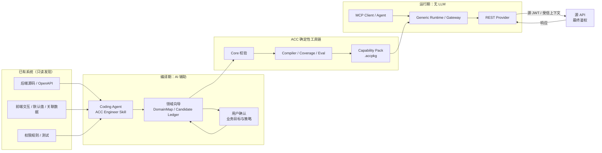
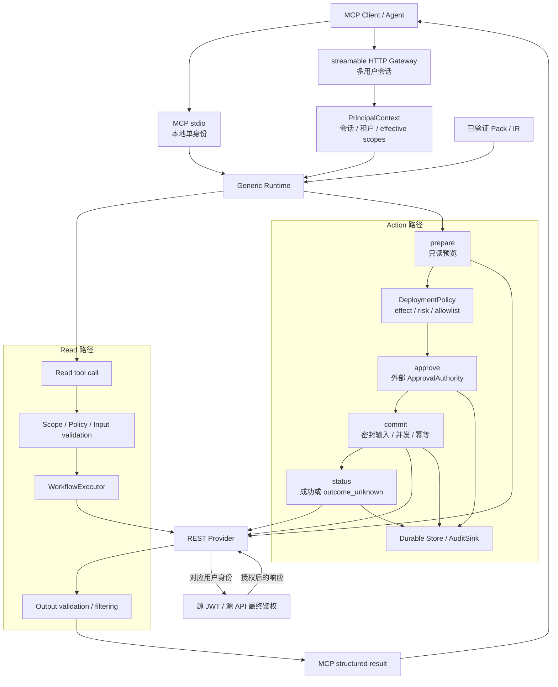

# README Architecture Diagrams Implementation Plan

> **For agentic workers:** REQUIRED SUB-SKILL: Use superpowers:subagent-driven-development (recommended) or superpowers:executing-plans to implement this plan task-by-task. Steps use checkbox (`- [ ]`) syntax for tracking.

**Goal:** Replace the README ASCII pipeline with a two-layer Mermaid architecture explanation: one end-to-end overview plus compile-time and runtime detail diagrams.

**Architecture:** Keep all diagrams inline in `README.md` so GitHub renders them without external assets. The overview explains the product boundary; the detail diagrams explain deterministic compilation and the separate Read/Action runtime paths while preserving source-JWT final authorization.

**Tech Stack:** GitHub Markdown, Mermaid `flowchart`, Python pytest documentation assertions, Ruff Markdown formatting.

---

### Task 1: Replace the ASCII overview with a Mermaid end-to-end diagram

**Files:**
- Modify: `README.md:10-47`
- Test: `tests/unit/skill/test_skill_structure.py`

- [ ] **Step 1: Write the failing overview test**

Add imports and a helper near the top of `tests/unit/skill/test_skill_structure.py`:

```python
import re


def _readme_mermaid_blocks() -> list[str]:
    readme = (ROOT / "README.md").read_text(encoding="utf-8")
    return [section.split("```", maxsplit=1)[0] for section in readme.split("```mermaid\n")[1:]]
```

Add the focused test:

```python
def test_readme_opens_with_an_end_to_end_mermaid_architecture() -> None:
    blocks = _readme_mermaid_blocks()
    assert blocks
    overview = blocks[0]
    for label in (
        "已有系统（只读发现）",
        "编译期：AI 辅助",
        "ACC 确定性工具链",
        "Capability Pack",
        "运行期：无 LLM",
        "源 API<br/>最终鉴权",
    ):
        assert label in overview
    assert "```text\n已有系统源码" not in (ROOT / "README.md").read_text(encoding="utf-8")
```

- [ ] **Step 2: Run the focused test and verify RED**

Run:

```bash
uv run --frozen pytest -q tests/unit/skill/test_skill_structure.py::test_readme_opens_with_an_end_to_end_mermaid_architecture
```

Expected: FAIL because the README still contains the ASCII `text` diagram and has no Mermaid block.

- [ ] **Step 3: Replace the ASCII block with the overview diagram**

Replace the `完整链路如下` code block with:



Immediately after the diagram, add one paragraph stating that the Pack is the data-only boundary between AI-assisted compilation and no-LLM execution, and that user confirmation cannot replace Evidence or source authorization.

- [ ] **Step 4: Run the focused test and verify GREEN**

Run:

```bash
uv run --frozen pytest -q tests/unit/skill/test_skill_structure.py::test_readme_opens_with_an_end_to_end_mermaid_architecture
```

Expected: `1 passed`.

- [ ] **Step 5: Commit the overview**

```bash
git add README.md tests/unit/skill/test_skill_structure.py
git commit -m "docs(readme): 增加 ACC 端到端架构总览"
```

### Task 2: Add compile-time and runtime detail diagrams

**Files:**
- Modify: `README.md:83-105`
- Test: `tests/unit/skill/test_skill_structure.py`

- [ ] **Step 1: Write failing detail-diagram and structure tests**

Add:

```python
def test_readme_has_compile_and_runtime_architecture_details() -> None:
    blocks = _readme_mermaid_blocks()
    assert len(blocks) == 3
    compile_time, runtime = blocks[1:]
    for label in (
        "Evidence / Scope Inventory",
        "DomainMap / Candidate Ledger",
        "一次处理一个领域",
        "DomainDecision",
        "Schema / Closure / Action Safety",
        "Capability IR",
        "Evidence 缺口 / 冲突",
    ):
        assert label in compile_time
    for label in (
        "MCP stdio",
        "streamable HTTP Gateway",
        "PrincipalContext",
        "Read tool call",
        "prepare",
        "approve",
        "commit",
        "status",
        "DeploymentPolicy",
        "源 JWT / 源 API 最终鉴权",
    ):
        assert label in runtime


def test_readme_mermaid_blocks_have_stable_structure() -> None:
    blocks = _readme_mermaid_blocks()
    assert len(blocks) == 3
    for block in blocks:
        assert block.startswith("flowchart ")
        assert block.count("subgraph ") == sum(line.strip() == "end" for line in block.splitlines())
        node_ids = re.findall(r"^\s*([A-Z][A-Z0-9_]*)\[", block, flags=re.MULTILINE)
        assert node_ids
        assert len(node_ids) == len(set(node_ids))
    assert "baogao" not in "\n".join(blocks).lower()
```

- [ ] **Step 2: Run the focused tests and verify RED**

Run:

```bash
uv run --frozen pytest -q tests/unit/skill/test_skill_structure.py -k 'readme_has_compile or mermaid_blocks'
```

Expected: FAIL because only the overview exists.

- [ ] **Step 3: Add the compile-time detail diagram**

Under `## 架构`, before the component table, add `### 编译期：从系统事实到 Capability Pack` and:

```mermaid
flowchart LR
  subgraph discovery["只读发现"]
    SOURCES["Backend / OpenAPI / Frontend / Tests"]
    SCAN["Coding Agent + ACC Engineer Skill"]
    FACTS["Evidence / Scope Inventory"]
  end

  subgraph domains["领域向导"]
    LEDGER["DomainMap / Candidate Ledger"]
    SELECT["依赖就绪排序<br/>一次处理一个领域"]
    GOALS["用户确认业务目标 / DomainPolicy"]
    DECISION["版本化 DomainDecision"]
  end

  subgraph contracts["当前格式项目"]
    SOURCE_CONTRACT["SourceContract / InteractionContract"]
    DEFINITION["Operation / Capability / Policy / Eval"]
  end

  subgraph gates["确定性门禁"]
    VALIDATE["Schema / Closure / Action Safety"]
    ANALYZE["Coverage / Contract Tests"]
    IR["Capability IR"]
    PACK_BUILD["确定性 Capability Pack"]
  end

  BLOCKED["Evidence 缺口 / 冲突<br/>保持 blocked 或 unknown"]

  SOURCES --> SCAN --> FACTS --> LEDGER
  LEDGER --> SELECT --> GOALS --> DECISION
  DECISION --> SOURCE_CONTRACT --> DEFINITION --> VALIDATE
  VALIDATE -->|"通过"| ANALYZE --> IR --> PACK_BUILD
  VALIDATE -->|"诊断"| BLOCKED --> SCAN
```



Follow with a paragraph explaining that AI proposes candidates, while only deterministic validation can produce IR and Pack.

- [ ] **Step 4: Add the runtime detail diagram**

After the compile-time explanation, add `### 运行期：Read 与 Action 共用源权限终裁` and:



Follow with a paragraph stating that stdio and Gateway only change identity/session transport; both Read and Action still rely on the source system for final authorization. State that production Action requires deployment-provided durable Store, ApprovalAuthority, and AuditSink.

- [ ] **Step 5: Update the component guide and invariants**

Rename the existing component-table introduction to `### 组件职责`, keep the five existing rows, and extend the `acc-runtime` and `acc-testkit` descriptions to include Gateway/Action and interaction evaluation.

Add `### 读图时必须保持的边界` with exactly these five statements:

1. Core 与 Runtime 不调用 LLM；AI 只在 Coding Agent 的编译期。
2. Pack 不保存用户账号、密码、JWT 或可直接使用的 Authorization Header。
3. 用户确认只表达业务目标与策略，不能替代 Evidence 或授予源权限。
4. Read tool 不能绕过 `prepare → approve → commit → status` 执行 mutation。
5. Fake/offline 验证不能升级为生产 `source_connected_verified`。

- [ ] **Step 6: Run detail tests and full document regression**

Run:

```bash
uv run --frozen pytest -q tests/unit/skill/test_skill_structure.py
uv run --frozen ruff format --check README.md tests/unit/skill/test_skill_structure.py
uv run --frozen ruff check tests/unit/skill/test_skill_structure.py
git diff --check
```

Expected: all commands exit 0 and the Skill structure suite reports 21 tests or more.

- [ ] **Step 7: Commit the detail diagrams**

```bash
git add README.md tests/unit/skill/test_skill_structure.py
git commit -m "docs(readme): 解释编译期与运行期架构"
```

### Task 3: Final README architecture acceptance

**Files:**
- Verify: `README.md`
- Verify: `tests/unit/skill/test_skill_structure.py`

- [ ] **Step 1: Check the rendered-source boundaries**

Run:

```bash
rg -n '^```mermaid|^flowchart |编译期：AI 辅助|运行期：无 LLM|源 JWT / 源 API 最终鉴权' README.md
rg -n -i 'baogao|baogao-jin' README.md
```

Expected: three Mermaid blocks and all platform-neutral boundary labels are present; project-specific search returns no matches.

- [ ] **Step 2: Run final focused release gates**

Run:

```bash
uv run --frozen pytest -q tests/unit/skill/test_skill_structure.py
uv run --frozen ruff format --check .
uv run --frozen ruff check .
git diff --check
```

Expected: all commands exit 0. No full Runtime suite is required because production code, Schema, Pack, and Runtime behavior are unchanged.

- [ ] **Step 3: Confirm the worktree boundary**

Run:

```bash
git status --short
```

Expected: only the intentionally preserved `.understand-anything/` path may remain untracked after the README commits.
