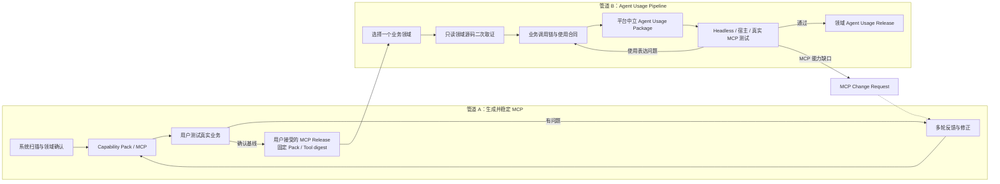

# ACC Agent Usage Pipeline 设计

日期：2026-08-11  
状态：已确认，待实施计划

## 1. 背景

ACC 现有主流程负责从目标系统事实中发现、建模、验证并发布 Capability Pack / MCP。MCP 的 Tool Schema 能说明“有哪些工具、参数和结果是什么”，但不能完整说明最终 Agent 应如何实现真实业务目标，尤其是：

- 页面进入、搜索、详情、关联数据之间的调用顺序；
- 输入来自用户、路由、所选记录、上一步结果还是可信上下文；
- 前端默认值、条件显示、级联选项和结果消费；
- 空结果、权限拒绝、超时、并发冲突和不确定结果的处理；
- Action 的受信生命周期和禁止行为。

这些语义往往需要结合前端、后端、测试和已经稳定的 MCP 才能重建。因此，Agent 使用指南不能成为现有 MCP 生成管道的附带输出，也不能在 MCP 尚未经过用户多轮测试时提前固化。

## 2. 核心决策

ACC 增加一条独立、可选但推荐的 **Agent Usage Pipeline**：

- 管道 A 继续负责生成和稳定 MCP；
- 用户对真实 MCP 进行多轮测试、反馈和修正；
- 用户明确接受一个固定 MCP Release 后，才可启动管道 B；
- 管道 B 按领域重建 Agent 使用语义，生成平台中立 Agent Usage Package；
- Codex、Claude、OpenClaw、自研 Agent 等仅是可选宿主适配器，不是核心格式；
- 管道 B 发现 MCP 缺口时生成 Change Request 返回管道 A，不直接修改 MCP；
- MCP Release 变化后，通过依赖图局部判断 Usage Package 是否需要复验、重生成或阻断。

## 3. 目标与非目标

### 3.1 目标

1. 基于用户已接受的 MCP Release 生成可审计、可测试的 Agent 使用合同。
2. 通过选定领域的前端、后端、测试和文档只读扫描补足业务调用链。
3. 按业务领域逐个生成、测试和发布，不让用户逐接口确认。
4. 让平台中立结构化合同成为事实源，宿主 Skill / Guide 只是适配产物。
5. 将业务使用问题与 MCP 能力缺口自动分流到正确管道。
6. 保持源 JWT 和源 API 的最终授权地位，不在 Skill 中复制权限系统。
7. 对源码、MCP 和宿主变化执行确定性影响分析和局部失效。

### 3.2 非目标

- 不在管道 A 编译时自动生成最终 Agent Skill。
- 不要求所有 MCP Release 都生成 Usage Package。
- 不生成一个一次加载全部工具的巨大提示词或 Skill。
- 不把 Codex `SKILL.md`、Claude 配置或其他宿主格式作为核心合同。
- 不让用户判断 HTTP、Schema、JWT、幂等或并发等技术事实。
- 不根据前端隐藏按钮推导源权限。
- 不把用户确认当作 Evidence、源授权或生产验证。
- 不在默认测试中执行真实 mutation。

## 4. 双管道架构



两条管道拥有独立的版本、状态、报告和发布动作。管道 B 只能引用一个不可变 MCP Release；它不能在原 Capability Pack 内追加文件，也不能静默修改 Tool Schema。

## 5. 管道 B 启动门禁

启动输入为 `McpReleaseAcceptance`：

```yaml
schema_version: "2"
release_id: mcp-release-2026-08-11
pack_digest: "<sha256>"
ir_digest: "<sha256>"
tool_schema_digest: "<sha256>"
accepted_domain_ids:
  - finance
test_report_digest: "<sha256>"
known_limitations: []
accepted_by: "<non-secret confirmer ref>"
accepted_at: "2026-08-11T00:00:00Z"
```

门禁要求：

1. Pack、IR、Tool Schema 和 Test Report digest 可重算且精确匹配。
2. `accepted_domain_ids` 已存在于对应 MCP Release 的领域事实中。
3. 接受记录不包含账号、JWT、密码、Authorization 或业务数据。
4. 已知限制必须保留，不能在管道 B 中删除或降级。
5. 用户接受仅表示“可作为 Usage Pipeline 基线”，不代表生产权限或全部场景已验证。

## 6. 领域级处理流程

管道 B 一次只激活一个依赖就绪的业务领域：

```text
B0  MCP Release 完整性与漂移检查
B1  推荐下一个依赖就绪领域
B2  用户选择：处理 / 延后 / 不需要
B3  只读扫描该领域及直接依赖
B4  自动生成证据清晰的使用场景
B5  集中询问少量业务冲突或高风险选择
B6  生成平台中立 Usage Package
B7  Headless Agent Eval
B8  目标宿主或真实 MCP 测试
B9  用户接受该领域 Usage Release
```

完成一个领域后才推荐下一个领域。顶层领域索引只包含已发布领域；测试中、阻断或延后的领域不得进入可用路由。

## 7. 只读源码二次取证

### 7.1 扫描范围

二次取证不是重新扫描整个系统，只读取当前领域及直接依赖：

- 前端页面、路由、状态管理、API Client 和组件测试；
- 对应后端路由、Schema、Service 和测试；
- 产品文档和现有 Interaction Evidence；
- 当前 MCP Capability、Tool Schema、Eval 和测试报告。

### 7.2 前端可证明的事实

前端证据可以支持：

- 页面或事件触发的调用顺序；
- 请求参数来自路由、表单、所选记录或前序响应；
- UI 默认、显示、启用、必填、重置和级联关系；
- 列表、详情、表格、下载和导航的结果消费；
- loading、empty、error、retry 等交互状态；
- 当前产品实际组合了哪些 Read Capability。

### 7.3 前端不能证明的事实

前端证据不能证明：

- 用户最终拥有源权限；
- 后端 effect、risk、幂等或并发安全；
- 隐藏或 disabled 等价于授权拒绝；
- UI 默认自动成为后端权威默认；
- 某个 Action 可以绕过受信生命周期；
- 源 API 在生产环境已经连接或验收。

这些事实继续由 SourceContract、后端实现、测试、Compiler、Runtime 和源 API 决定。

### 7.4 源码版本绑定

`SourceSnapshot` 至少记录：

```yaml
source_revision: "<git revision or frozen artifact digest>"
frontend_evidence_digest: "<sha256>"
backend_evidence_digest: "<sha256>"
test_evidence_digest: "<sha256>"
interaction_inventory_digest: "<sha256>"
```

若源码版本与 MCP Release 对应 Evidence 发生未处理漂移，当前领域进入 `source_drift`，停止发布并生成影响报告或 MCP Change Request。

## 8. 平台中立 Agent Usage Package

### 8.1 工程结构

```text
agent-usage-project/
├── project.yaml
├── mcp-release-acceptance.yaml
├── source-snapshot.yaml
├── domain-index.yaml
├── usage-evidence/
│   ├── frontend/
│   ├── backend/
│   └── tests/
├── domain-usage-contracts/
├── scenarios/
├── adapters/
├── evals/
├── test-report.json
├── risk-report.json
└── HANDOFF.md
```

`domain-usage-contracts/*.yaml` 和 `scenarios/*.yaml` 是事实源。Markdown、宿主 Skill、Prompt、Resource 或插件 Manifest 都由这些结构化合同生成。

### 8.2 DomainUsageContract

每个领域合同至少包含：

```yaml
schema_version: "2"
domain_id: finance
mcp_release_digest: "<sha256>"
source_snapshot_digest: "<sha256>"
business_goals: []
tool_routes: []
input_bindings: []
defaults: []
conditions: []
option_sources: []
related_data: []
result_consumption: []
error_handling: []
action_lifecycles: []
prohibited_behaviors: []
required_scenario_ids: []
evidence_claims: []
```

每条 `tool_route` 必须绑定当前 MCP Release 中的 Capability ID，并描述：

- 业务目标；
- 前置条件；
- 调用步骤和停止条件；
- public input 的来源；
- 前序输出到后序输入的 JSON Pointer 映射；
- 空结果和失败分支；
- 最终公开结果消费；
- 可否重试；
- Action 生命周期和不确定结果处理。

### 8.3 平台中立发布与宿主适配

核心产物为 Agent Usage Package。其发布方式可包括：

- MCP Resources / Prompts overlay；
- 通用结构化合同和 Markdown Agent Guide；
- Codex Skill Adapter；
- Claude / Claude Code Adapter；
- OpenClaw Adapter；
- 自研 Agent 插件或配置适配器。

任何具体宿主适配器都不能成为核心事实源。一个适配器通过验证不能自动升级其他适配器的验证等级。

## 9. AI 与用户的职责边界

### 9.1 AI 自动处理

以下情况由 AI 自动取证、建模和测试，不询问用户：

- 前端调用顺序与 MCP Capability 精确对应；
- public input 可从用户输入或上一步公开输出构造；
- 默认、条件、选项和关联数据有一致 Evidence；
- 错误和空状态已有代码或测试证据；
- Action Safety 已由管道 A 证明；
- 同一业务目标只有一条明确可行路径。

### 9.2 仅在必要时询问用户

用户只处理：

1. 业务领域是否需要、延后或排除；
2. 一个领域要覆盖哪些业务目标；
3. 多条同样合理的产品流程如何取舍；
4. 前后端证据冲突时的业务意图；
5. 高风险 Action 是否进入 Agent 使用指南；
6. 哪些场景必须使用真实账号、数据或环境验收；
7. 该领域是否接受发布及其已知限制。

用户不负责判断 route、HTTP、Schema、JWT、Evidence digest、幂等、并发或 Capability constructability。技术事实不闭合时保持 `blocked` 或退回管道 A。

## 10. 反馈自动分流

| 反馈 | 处理位置 |
| --- | --- |
| Agent 不会选择正确工具 | 管道 B 修正 Usage Contract / Adapter |
| Agent 参数组合错误 | 先检查管道 B；Tool Schema 不足则返回管道 A |
| MCP 缺工具、Schema 错误或 Runtime 错误 | 管道 A MCP Change Request |
| 源 API 返回 401/403 | 保留源系统裁决，不扩大 ACC Scope |
| 业务结果不符合产品意图 | 重新对照前端、后端和用户目标取证 |
| MCP digest 不匹配 | 当前 Usage Release 标记 stale，执行影响分析 |

Change Request 必须引用受影响领域、场景、Capability、Evidence 和旧新 digest，不能携带敏感 payload。

## 11. 验证模型

验证使用独立轴，不生成总分或 `usable=true`：

```text
source_usage_traced
usage_contract_verified
headless_agent_verified
host_adapter_verified
real_mcp_verified
user_accepted
```

- `source_usage_traced`：源码业务调用链已建立 Evidence 关联。
- `usage_contract_verified`：调用、绑定、条件、结果和错误合同通过确定性校验。
- `headless_agent_verified`：参考 Evaluator 能完成声明场景。
- `host_adapter_verified`：指定宿主适配器通过其一致性套件。
- `real_mcp_verified`：实际 Agent 连接固定 MCP Release 完成场景。
- `user_accepted`：用户接受该领域的范围和限制。

这些轴互不蕴含；源码关联不能升级真实 MCP，Codex 适配通过不能升级其他宿主，用户接受不能替代技术 Evidence。

## 12. 测试要求

每个领域至少覆盖：

- 正常业务路径；
- 空结果；
- public input 缺失；
- 关联对象不存在；
- 401/403/404；
- 超时和源错误；
- stale 前序结果；
- 多个候选工具时的正确选择；
- prohibited behavior；
- Action prepare、按需 approve、commit 和独立 status；
- 并发冲突和 `outcome_unknown`；
- Pack、Tool Schema 或 Source Snapshot digest 不匹配。

真实 mutation 默认不执行。只有用户明确授权具体环境和操作后才允许 source-connected Action Eval；授权范围不因 Usage Pipeline 自动扩大。

## 13. 发布门禁

单领域发布至少要求：

1. MCP Release 引用完整且 digest 匹配；
2. 当前领域不存在未处理 source drift；
3. required scenarios 均有 Usage Contract；
4. 必需输入均可构造；
5. Tool 和 Capability 引用属于当前 MCP Release；
6. Action 保持编译证明的受信生命周期；
7. Secret 和敏感业务数据扫描通过；
8. Usage Contract 验证通过；
9. Headless Eval 通过；
10. 用户确认发布范围和已知限制。

未完成宿主或真实 MCP 测试时可发布 `limited`，但必须保留独立验证状态，不得宣称全面验证。

## 14. 局部失效与影响分析

依赖图为：

```text
Domain
  -> Scenario
    -> Capability
      -> Tool Schema
        -> Source Evidence
```

MCP或源码变化后，每个领域得到独立结果：

- `unaffected`：无引用变化；
- `revalidate`：合同仍成立，只需重跑测试；
- `regenerate`：绑定或描述发生兼容性变化，需要重新生成；
- `blocked`：Capability、Evidence 或安全合同已无法闭合。

不得因一个工具变化而让所有领域失效，也不得仅比较顶层 Pack digest 后静默继续使用旧指南。

## 15. AgentUsageRelease

```yaml
schema_version: "2"
usage_release_id: finance-2026-08-11
domain_id: finance
mcp_release_id: mcp-release-2026-08-11
mcp_pack_digest: "<sha256>"
tool_schema_digest: "<sha256>"
source_snapshot_digest: "<sha256>"
scenario_ids: []
capability_ids: []
verification:
  source_usage_traced: true
  usage_contract_verified: true
  headless_agent_verified: true
  host_adapter_verified: false
  real_mcp_verified: false
  user_accepted: true
release_status: limited
known_limitations: []
host_adapters: []
```

Agent 启动使用前应比较当前 MCP `runtime/info` 或 Tool Schema digest。宿主无法自动比较时必须提示人工确认，不能静默加载旧 Usage Release。

## 16. 安全和权限边界

1. Usage Package 不携带账号、密码、JWT、Cookie、Authorization 或可直接使用的签名 URL。
2. Agent 使用指南不能授予、模拟或推导源权限。
3. 源 JWT 与源 API 对每次真实请求执行最终鉴权。
4. 前端隐藏或 disabled 不是授权证据。
5. `403` 不自动触发 Scope 扩大、换用高权账号或隐藏错误。
6. Action approval 不能替代源授权。
7. trusted context 不得转换成 public Agent input。
8. Error、Trace、Eval 和报告不得保存敏感 payload。
9. Host Adapter 只能收窄或忠实投影 Usage Contract，不能增加未声明工具或行为。

## 17. 建议 CLI 表面

管道 B 使用独立命令域，避免与管道 A 的 `acc compile/pack/run` 混淆：

```text
acc usage init
acc usage status
acc usage scan --domain <id>
acc usage review --domain <id> --check
acc usage build --domain <id>
acc usage test --domain <id>
acc usage impact <change-set>
acc usage release --domain <id> --check
acc usage export --adapter <adapter-id>
```

所有写入命令只写独立 Agent Usage 工程；对目标源码和原 Capability Pack 均只读。

## 18. 实施顺序

1. 核心模型：McpReleaseAcceptance、SourceSnapshot、DomainUsageContract、Scenario、AgentUsageRelease。
2. 独立项目加载、Schema、closure 和 Secret 门禁。
3. 领域源码 usage scan 与 Evidence 绑定。
4. Tool route、input binding、条件、结果消费和 Action lifecycle analyzer。
5. Headless Agent Evaluator 和反馈分类。
6. 局部 impact analyzer。
7. 平台中立 Package builder。
8. MCP Resources / Prompts overlay 参考适配器。
9. 至少一个宿主 Adapter 作为一致性示例，但不进入核心合同。
10. 跨行业 fixtures、文档和完整发布门禁。

## 19. 验收标准

- 管道 A 可在完全不运行管道 B 的情况下独立发布 MCP。
- 未经用户接受的 MCP Release 不能启动 Usage build。
- 管道 B 能从前端证据重建搜索到详情、默认、条件和关联数据。
- 用户一次只确认一个领域和少量业务分歧，不逐接口确认。
- 平台中立合同不引用 Codex 专属结构。
- 不安装任何宿主 Adapter 也能校验和测试 Usage Package。
- MCP或源码变化只使受影响领域进入正确影响状态。
- 权限拒绝由源系统保持最终裁决。
- Action 不得绕过 `prepare` 和进入 `approved` 后才能 `commit` 的门禁；`approve` 仅在 proof 要求时调用，`status` 保持独立查询。
- 任意验证等级都不能被另一个等级或用户确认隐式提升。
- 所有生成物和报告通过 Secret 扫描且不包含真实凭据或敏感 payload。
